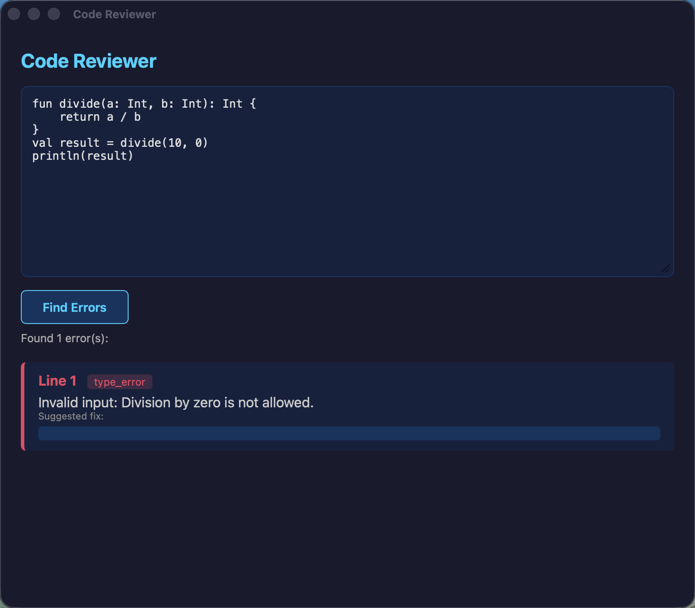

# Code Reviewer (Tauri + Candle LLM)

A desktop application that loads a local GGUF LLM via Candle and reviews code for bugs.

## Screenshots

### Empty state


### Analysis results


## What it does

- Paste any code into the text field
- Click **Find Errors**
- A local LLM (TinyLlama 1.1B) analyzes the code and returns structured results with error locations, types, descriptions, and suggested fixes

## How to run

```bash
cd code-reviewer
npm install
CARGO_REGISTRIES_CRATES_IO_PROTOCOL=sparse cargo tauri dev
```

## Download the model

```bash
mkdir -p ~/Library/Application\ Support/code-reviewer/

# TinyLlama 1.1B Chat Q4_K_M (~640MB)
curl -L "https://huggingface.co/TheBloke/TinyLlama-1.1B-Chat-v1.0-GGUF/resolve/main/tinyllama-1.1b-chat-v1.0.Q4_K_M.gguf" \
  -o ~/Library/Application\ Support/code-reviewer/model.gguf

# Tokenizer
curl -L "https://huggingface.co/TinyLlama/TinyLlama-1.1B-Chat-v1.0/resolve/main/tokenizer.json" \
  -o ~/Library/Application\ Support/code-reviewer/tokenizer.json
```

## Project structure

```
src-tauri/
  Cargo.toml            # Tauri 2 + Candle 0.8 dependencies
  src/main.rs            # Tauri command: loads GGUF model, runs inference
  src/model_wrapper.rs   # QuantizedModel trait for Candle
  icons/                 # App icons for all platforms
src/
  index.html             # Frontend UI with text input and results
screenshots/
  01-empty.png           # App empty state
  02-with-results.png    # App with analysis results
```

## Tech stack

- **Backend:** Rust, Tauri 2, Candle 0.8 (quantized LLM inference), tokenizers
- **Frontend:** Vanilla HTML/CSS/JS
- **Model:** TinyLlama 1.1B Chat Q4_K_M (GGUF format)

## Notes

- Requires `CARGO_REGISTRIES_CRATES_IO_PROTOCOL=sparse` due to `index.crates.io` being blocked on some networks
- The sparse protocol config is in `src-tauri/.cargo/config.toml`
- Run with `--release` for faster inference (debug mode is ~30x slower)
- Maximum input: 3840 tokens (~2000 lines of code)
